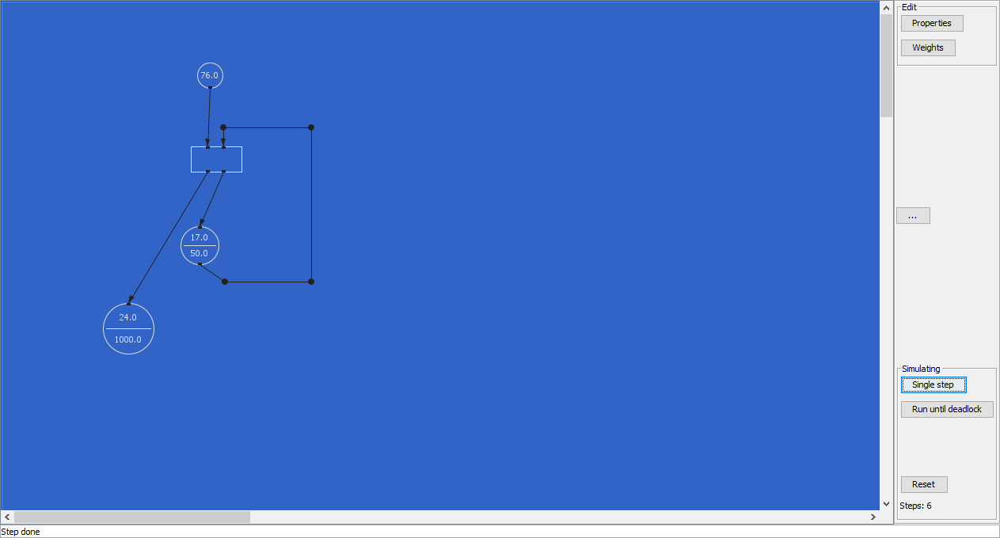

# README

A simple Petri net simulator, created in 2008 as part of my studies.

Originally developed as an applet under Java 6, in 2020 I adapted the
source code to the more recent Java 11. Also the application type was
changed. Instead of an applet it now is a SWING application.

# Features
You can create places and transitions, give them weights and create arcs
to connect them.

After creating the net it can be run, either in single step mode or 
until a deadlock appears.

See *ShortManual.md* for more documentation.

## Development environment

This very version has been tested with:

* Visual Studio Code
* Java extension Visual Studio Code
* OpenJDK 11 or later

With this set up, it should be running into a debugging session by 
hitting F5 in VSCode, happily.

### Fix launch errors

When launching the app from VSCode there is a chance the following error
appears: *Could not find or load main class*

To fix this, open the VSCode command palette with `<Ctrl + Shift + p>`
and enter + select the command `Clean the java language server
workspace`.
([Stackoverflow](https://stackoverflow.com/questions/57857855/could-not-find-or-load-main-class-vs-code))
